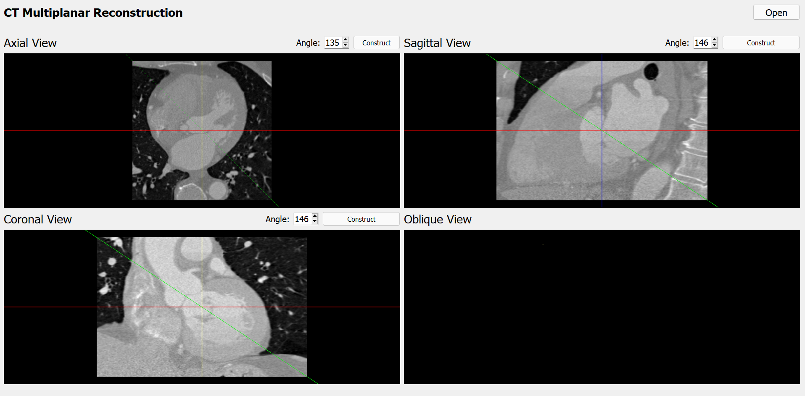
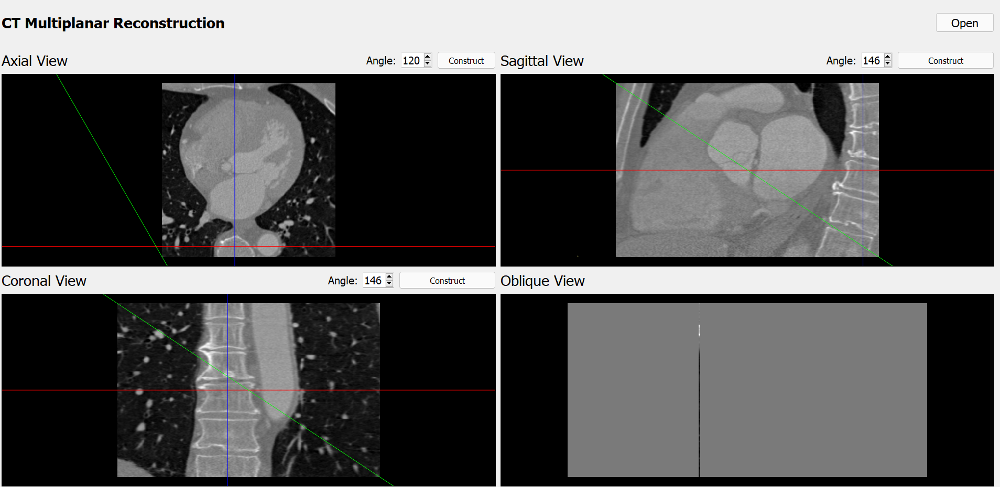

# Dicom_Viewer
### Creating a dicom viewer inspired by itk-snap
* This is the final project for (imaging modalities subject), we had to create a dicom viewer and we chose itk snap to be inspired by

* By moving the horizonta axis or vertical axis or both to a certain spot on one view, I can see that spot in the other two views automatically

